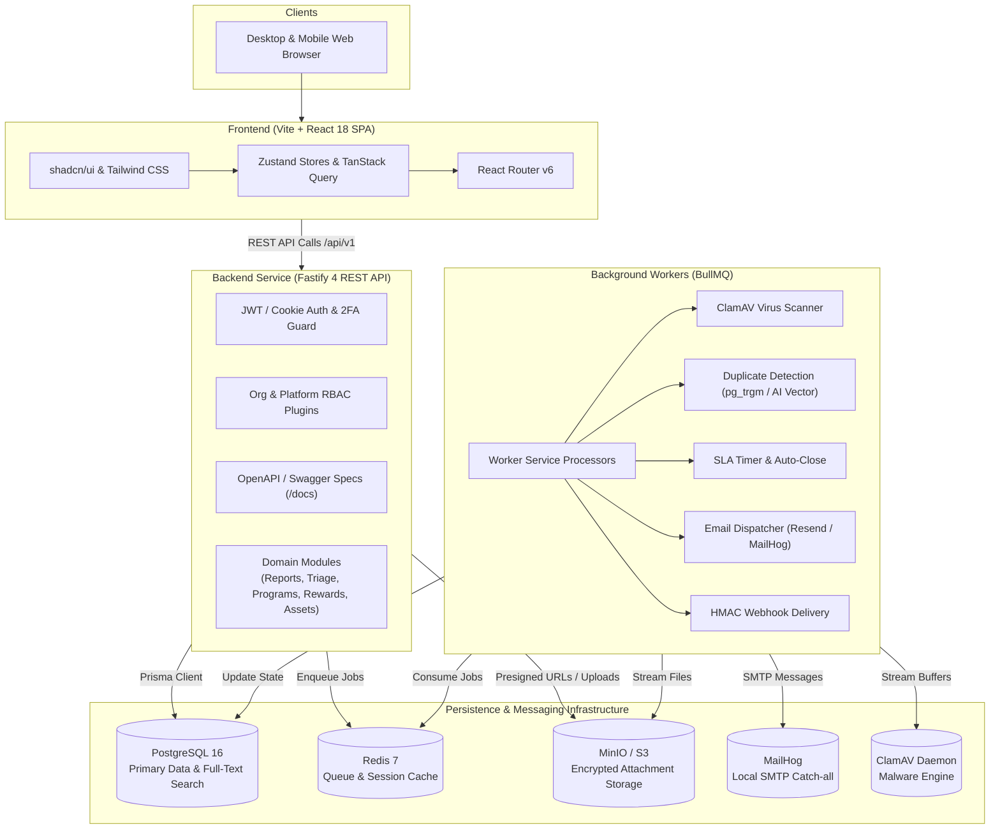
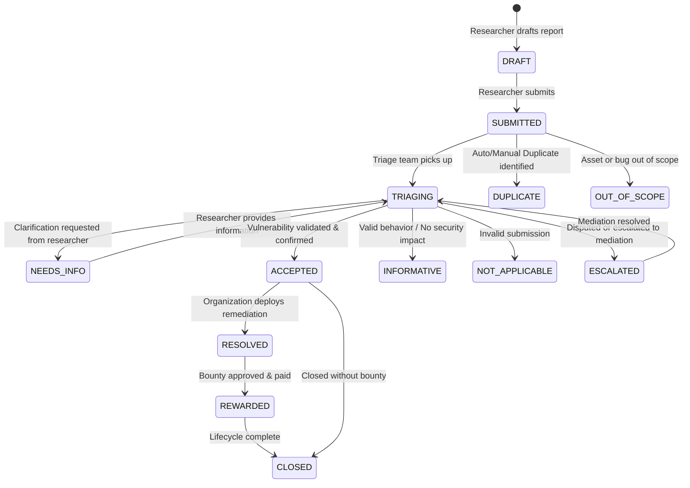
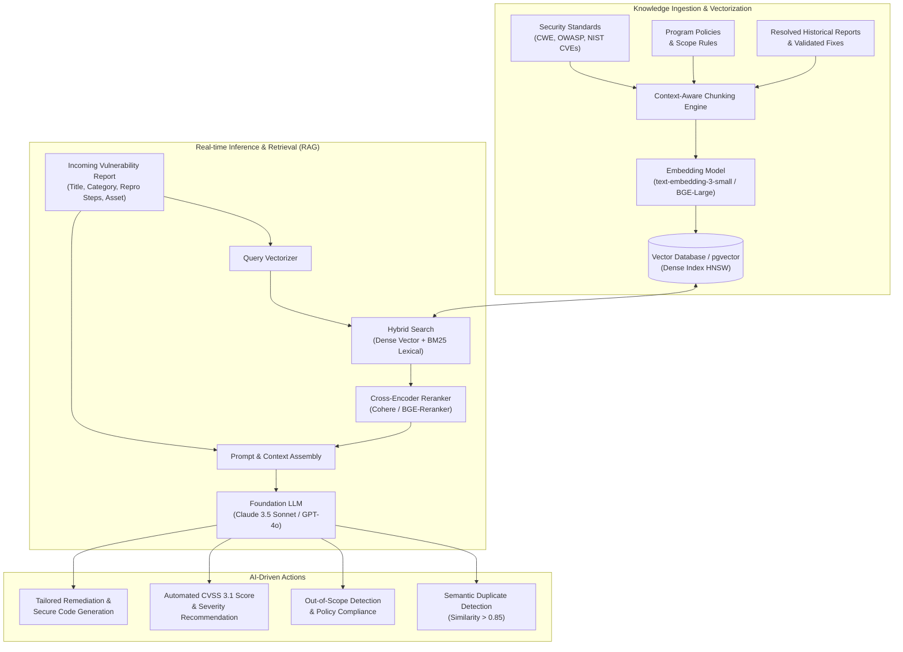

# BugHuntr — Enterprise Bug Bounty & Vulnerability Coordination Platform

[](https://www.typescriptlang.org/)
[](https://fastify.dev/)
[](https://react.dev/)
[](https://vitejs.dev/)
[](https://www.prisma.io/)
[](https://www.postgresql.org/)
[](https://redis.io/)
[](https://bullmq.io/)

**BugHuntr** is an enterprise-grade, full-lifecycle Bug Bounty and Vulnerability Disclosure Platform (VDP) built for ethical security researchers, program management teams, and system administrators. It orchestrates the end-to-end security vulnerability workflow: from authenticated submission, automated duplicate detection, and ClamAV malware scanning, to collaborative triage, SLA management, and secure multi-channel bounty payouts.

---

## Table of Contents

- [Overview](#overview)
- [System Architecture](#system-architecture)
  - [Monorepo Workspace Structure](#monorepo-workspace-structure)
  - [High-Level Architecture Diagram](#high-level-architecture-diagram)
  - [Vulnerability Report Lifecycle State Machine](#vulnerability-report-lifecycle-state-machine)
- [Key Features](#key-features)
  - [1. Security Researcher Hub](#1-security-researcher-hub)
  - [2. Organization & Program Operations](#2-organization--program-operations)
  - [3. Triage & SLA Enforcement](#3-triage--sla-enforcement)
  - [4. Rewards, Payouts & Financial Ledger](#4-rewards-payouts--financial-ledger)
  - [5. Enterprise Security & Administration](#5-enterprise-security--administration)
- [Technology Stack](#technology-stack)
- [Getting Started & How to Run](#getting-started--how-to-run)
  - [Prerequisites](#prerequisites)
  - [1. Clone and Install Dependencies](#1-clone-and-install-dependencies)
  - [2. Start Infrastructure Containers](#2-start-infrastructure-containers)
  - [3. Configure Environment Variables](#3-configure-environment-variables)
  - [4. Database Migration & Seeding](#4-database-migration--seeding)
  - [5. Run the Application](#5-run-the-application)
  - [Port Mappings & Default Access](#port-mappings--default-access)
- [AI & RAG (Retrieval-Augmented Generation) Architecture](#ai--rag-retrieval-augmented-generation-architecture)
  - [The Role of AI & RAG in Modern Bug Bounty](#the-role-of-ai--rag-in-modern-bug-bounty)
  - [Current Baseline: Fast Lexical Trigram Matching](#current-baseline-fast-lexical-trigram-matching)
  - [The RAG Pipeline Architecture](#the-rag-pipeline-architecture)
  - [Core AI & RAG Capabilities](#core-ai--rag-capabilities)
  - [Vector Database & Embedding Strategy](#vector-database--embedding-strategy)
  - [Guardrails, Privacy & Safety](#guardrails-privacy--safety)
- [Testing & Quality Assurance](#testing--quality-assurance)
- [Contributing & License](#contributing--license)

---

## Overview

Modern software development requires proactive security collaboration. BugHuntr bridges the gap between independent security researchers and organizations by offering:

- **Transparent Scope Management**: Granular asset targeting across domains, IP ranges, mobile applications, APIs, and cloud services.
- **Strict SLA Guarantees**: Time-to-first-response, time-to-triage, and time-to-resolution tracking backed by BullMQ cron workers.
- **Auditable Financials**: Strict integer-based currency representations, multi-gateway support, and approval workflows.
- **Zero-Trust File Handling**: Inbound attachment isolation and asynchronous antivirus inspection before asset availability.

---

## System Architecture

### Monorepo Workspace Structure

The project is structured as a high-performance monorepo managed with **Turborepo** and **pnpm workspaces**:

```
pfa2/
├── apps/
│   ├── api/                    # Fastify 4 REST API application
│   │   ├── src/
│   │   │   ├── modules/        # Modular domain services (auth, reports, triage, rewards, etc.)
│   │   │   ├── plugins/        # Fastify plugins (JWT auth, RBAC, error handlers)
│   │   │   ├── routes/         # Health and shared system endpoints
│   │   │   └── scripts/        # Seeding and maintenance scripts
│   │   └── package.json
│   └── worker/                 # BullMQ background job processing service
│       ├── src/
│       │   ├── processors/     # Virus scan, duplicate detection, SLA, emails, webhooks
│       │   └── emails/         # React Email transactional templates
│       └── package.json
├── frontend/                   # React 18 + Vite SPA client
│   ├── src/
│   │   ├── app/                # Application routes and views
│   │   ├── components/         # Radix UI + shadcn/ui components & layouts
│   │   ├── hooks/              # Custom React hooks (auth, queries, themes)
│   │   ├── pages/              # Researcher, Org, Admin, and Onboarding page views
│   │   ├── stores/             # Zustand state management (auth, global UI)
│   │   └── lib/                # API client, TanStack Query, and utility functions
│   └── package.json
├── packages/
│   ├── db/                     # Centralized Prisma ORM models, client, & migrations
│   │   ├── prisma/
│   │   │   └── schema.prisma   # PostgreSQL 16 domain schema
│   │   └── package.json
│   └── shared/                 # Shared TypeScript types, constants, and Zod schemas
│       ├── src/
│       └── package.json
├── docker-compose.yml          # Local infra: Postgres, Redis, MinIO, MailHog, ClamAV
├── turbo.json                  # Turborepo task pipeline configuration
├── pnpm-workspace.yaml         # pnpm workspace definition
└── package.json                # Root package orchestration
```

### High-Level Architecture Diagram



### Vulnerability Report Lifecycle State Machine



---

## Key Features

### 1. Security Researcher Hub

- **Seamless Registration**: Direct registration flow with email verification and instantaneous access to the researcher dashboard (bypassing corporate onboarding hurdles).
- **Public & Private Programs**: Discovery directory with scope details, reward structures, safe harbor policies, and direct invitation redemption.
- **Report Submission Engine**: Rich Markdown editor with structured Proof of Concept (PoC) fields, reproduction steps, severity estimation (CVSS 3.1 compatible), and drag-and-drop file attachments.
- **Reputation & Gamification**: Global leaderboards, reputation points based on validated severity, and badges for critical milestones.
- **Wallet & Payout Tracking**: Payout profile management with status tracking for bank transfers, Stripe, Wise, PayPal, and crypto addresses.

### 2. Organization & Program Operations

- **Corporate Onboarding**: Dedicated wizard allowing companies to either initialize a new organization workspace or join via secure, cryptographic invitation tokens.
- **Program Wizard**: Launch public, private, campaign, challenge, or emergency bounty programs with customizable reward tiers (`CRITICAL`, `HIGH`, `MEDIUM`, `LOW`, `INFORMATIONAL`).
- **Granular Scope / Asset Management**: Define and verify in-scope and out-of-scope targets (Domains, Wildcards, IP CIDR ranges, Mobile Apps, APIs, Source Repositories, Cloud infrastructure).
- **Team Collaboration & RBAC**: Invite members with explicit role constraints (`ORG_ADMIN`, `PROGRAM_MANAGER`, `REVIEWER`, `FINANCE`, `VIEWER`).

### 3. Triage & SLA Enforcement

- **Centralized Triage Queue**: Sort, filter, and review reports by severity, status, SLA deadline, program, and submitter.
- **SLA Countdown Timers**: Automated tracking of:
  - _Time to First Response_ (Default: 24 hours)
  - _Triage Decision_ (Default: 5 days)
  - _Fix & Remediation SLA_ (Dynamic by severity: 30, 60, or 90 days)
- **Duplicate Detection**: Integrated worker that evaluates incoming reports against past submissions using lexical similarity algorithms to prevent duplicate bounty payouts.
- **Internal & External Collaboration**: Segmented discussions allowing internal private notes between reviewers or bidirectional comments with researchers.

### 4. Rewards, Payouts & Financial Ledger

- **Integer-Precision Currency**: All monetary amounts are handled and stored in integer cents (smallest monetary denomination) to eliminate IEEE 754 floating-point rounding errors.
- **Two-Phase Payout Approvals**: Segregation of duties between Program Managers (who approve vulnerability payouts) and Finance Managers (who execute transactions).
- **Audit Trails**: Every reward decision, bonus allocation, and payout state change produces an immutable audit record.

### 5. Enterprise Security & Administration

- **Authentication & 2FA**: JSON Web Tokens (15-minute access token) coupled with HTTP-only 30-day refresh cookies, and TOTP two-factor authentication.
- **Antivirus Pipeline**: Inbound attachments are quarantined in MinIO/S3 and validated via ClamAV before becoming accessible.
- **Platform Command Center**: Super Admin capabilities including global feature flags, organization verification, user banning, BullMQ queue health dashboards, and platform-wide announcement banners.
- **Webhook Subsystem**: HMAC-SHA256 signed event deliveries for integration with external SIEMs, Slack, or Jira.

---

## Technology Stack

| Layer                     | Technologies                                                                                                                                        | Description / Role                                                                        |
| :------------------------ | :-------------------------------------------------------------------------------------------------------------------------------------------------- | :---------------------------------------------------------------------------------------- |
| **Backend API**           | [Node.js 20](https://nodejs.org/), [TypeScript 5](https://www.typescriptlang.org/), [Fastify 4](https://fastify.dev/)                               | High-throughput, schema-driven REST API with low overhead                                 |
| **API Docs & Validation** | [Zod](https://zod.dev/), [Fastify Swagger](https://github.com/fastify/fastify-swagger), [Swagger UI](https://github.com/fastify/fastify-swagger-ui) | Runtime request/response validation and interactive OpenAPI 3.0 documentation             |
| **Frontend SPA**          | [React 18](https://react.dev/), [Vite 5](https://vitejs.dev/), [TypeScript](https://www.typescriptlang.org/)                                        | Modern, fast-refresh client-side single page web application                              |
| **UI & Styling**          | [Tailwind CSS](https://tailwindcss.com/), [shadcn/ui](https://ui.shadcn.com/), [Radix UI](https://www.radix-ui.com/), [Lucide](https://lucide.dev/) | Accessible, dark-mode ready design system with responsive primitives                      |
| **State & Data Fetching** | [TanStack React Query v5](https://tanstack.com/query), [Zustand 5](https://zustand-demo.pmnd.rs/)                                                   | Server cache synchronization, optimistic updates, and persistent client state             |
| **Database & ORM**        | [PostgreSQL 16](https://www.postgresql.org/), [Prisma ORM 5.20](https://www.prisma.io/)                                                             | Relational database with full-text search, trigram indexing, and strict schema migrations |
| **Task Queue & Cache**    | [Redis 7](https://redis.io/), [BullMQ 5.13](https://bullmq.io/), [ioredis](https://github.com/redis/ioredis)                                        | Distributed background job queues, rate limiting, and session caching                     |
| **Storage & Media**       | [MinIO](https://min.io/) / [AWS S3 SDK](https://aws.amazon.com/sdk-for-javascript/)                                                                 | S3-compatible object storage for vulnerability PoC evidence and exports                   |
| **Security & Malware**    | [ClamAV](https://www.clamav.net/), [Argon2](https://github.com/ranisalt/node-argon2), [OTPLib](https://github.com/yeojinj/otplib)                   | Antivirus scanning daemon, password hashing, and RFC 6238 TOTP                            |
| **Communications**        | [Resend](https://resend.com/), [React Email](https://react.email/), [MailHog](https://github.com/mailhog/MailHog)                                   | Transactional email delivery with local development SMTP interceptor                      |
| **Monorepo Tooling**      | [Turborepo 2](https://turbo.build/repo), [pnpm 9](https://pnpm.io/)                                                                                 | Incremental builds, remote caching, and isolated workspace packages                       |
| **Testing Engine**        | [Vitest 3](https://vitest.dev/), [Supertest](https://github.com/ladjs/supertest), [Playwright](https://playwright.dev/)                             | Unit tests, HTTP endpoint integration tests, and browser end-to-end automation            |

---

## Getting Started & How to Run

### Prerequisites

Ensure you have the following installed on your host machine:

- **Node.js**: `v20.0.0` or higher
- **pnpm**: `v9.0.0` or higher (`npm install -g pnpm`)
- **Docker & Docker Compose**: For spinning up database, cache, storage, and scanning daemons

### 1. Clone and Install Dependencies

```bash
# Clone the repository
git clone https://github.com/youssefbenyoussefyby/pfa2.git
cd pfa2

# Install dependencies across all workspace packages
pnpm install
```

### 2. Start Infrastructure Containers

Launch the required local services using Docker Compose:

```bash
docker-compose up -d
```

Verify that all 5 services are healthy and running:

```bash
docker-compose ps
```

### 3. Configure Environment Variables

Copy the provided example environment template to `.env`:

```bash
# In the workspace root
cp .env.example .env
```

Review and adjust any values as necessary. For local development, the defaults supplied in `.env.example` seamlessly match the `docker-compose.yml` service configurations.

### 4. Database Migration & Seeding

Generate the Prisma Client and apply migrations to initialize your PostgreSQL schema:

```bash
# Generate the Prisma Client
pnpm db:generate

# Push or apply database migrations
pnpm db:push

# Optional: Open Prisma Studio to inspect the database schema and records
pnpm db:studio
```

Seed the default Super Administrator account:

```bash
cd apps/api
npx tsx src/scripts/seed-admin.ts
cd ../..
```

### 5. Run the Application

#### A. Run Backend API and Worker (Turborepo)

To start the API service and the BullMQ background worker concurrently:

```bash
pnpm dev
```

- **API Server**: Starts on `http://localhost:3000`
- **Swagger Documentation**: Available at `http://localhost:3000/docs`
- **BullMQ Workers**: Bootstrapped and listening for incoming jobs on Redis

#### B. Run Frontend Client

In a separate terminal window, start the Vite development server:

```bash
cd frontend
pnpm dev
```

- **Frontend Client**: Accessible at `http://localhost:8080` (with automatic reverse-proxy routing `/api` requests to `http://localhost:3000`).

---

### Port Mappings & Default Access

| Service                  | Host URL / Port              | Credentials / Purpose                                    |
| :----------------------- | :--------------------------- | :------------------------------------------------------- |
| **Frontend Web App**     | `http://localhost:8080`      | Main application UI (Researchers, Organizations, Admins) |
| **Backend REST API**     | `http://localhost:3000`      | Fastify REST endpoints                                   |
| **API Swagger UI**       | `http://localhost:3000/docs` | Interactive OpenAPI documentation and test console       |
| **PostgreSQL Database**  | `localhost:5432`             | `bughuntr` / `bughuntr_pass` (DB: `bughuntr`)            |
| **Redis Cache & Queue**  | `localhost:6379`             | In-memory message broker & session store                 |
| **MinIO Object Console** | `http://localhost:9001`      | `minioadmin` / `minioadmin` (S3 API on port `9000`)      |
| **MailHog Web UI**       | `http://localhost:8025`      | Local email inbox (SMTP on port `1025`)                  |
| **ClamAV Daemon**        | `localhost:3310`             | Antivirus streaming socket                               |
| **Default Super Admin**  | `admin@bughuntr.com`         | Password: `Admin123!` (after running seed script)        |

---

## AI & RAG (Retrieval-Augmented Generation) Architecture

> [!IMPORTANT]
> **PFA Focus Area**: This section details the theoretical and practical integration of Artificial Intelligence and Retrieval-Augmented Generation (RAG) into BugHuntr to solve core challenges in cybersecurity vulnerability orchestration.

### The Role of AI & RAG in Modern Bug Bounty

Managing vulnerability disclosure programs at scale poses significant operational challenges:

1. **Report Flooding & Triager Fatigue**: Large public programs often receive dozens of reports per day, of which up to 60–70% can be spam, out-of-scope, or duplicates.
2. **Duplicate Detection Inefficiencies**: Vulnerability descriptions vary wildly. A SQL injection might be described by one researcher as _"Time-based blind in /api/users"_ and by another as _"SLEEP benchmark delay in search query parameter"_. Traditional keyword searches fail to connect these semantically identical findings.
3. **Inconsistent CVSS Scoring**: Researchers frequently overestimate vulnerability severity to claim higher payouts, forcing triage teams into lengthy manual evaluations.
4. **Remediation Delays**: Engineering teams receiving accepted reports often lack clear, actionable code-level remediation advice for the specific vulnerability context.

To solve these problems, BugHuntr integrates a hybrid **Retrieval-Augmented Generation (RAG)** pipeline.

---

### Current Baseline: Fast Lexical Trigram Matching

BugHuntr currently features an automated asynchronous duplicate detection worker located at:
[`apps/worker/src/processors/duplicate-detection.ts`](apps/worker/src/processors/duplicate-detection.ts)

Whenever a new report is submitted:

1. A background job is dispatched to BullMQ.
2. The worker queries active reports submitted within the last 90 days in the same program.
3. It computes string similarity using PostgreSQL's trigram matching extension (`pg_trgm`):
   ```sql
   SELECT id, title, repro_steps,
          similarity(title, $1) as title_similarity,
          similarity(repro_steps, $2) as repro_similarity
   FROM reports
   WHERE program_id = $3
     AND status IN ('SUBMITTED', 'TRIAGING', 'ACCEPTED')
     AND (similarity(title, $1) > 0.5 OR similarity(repro_steps, $2) > 0.5)
   ORDER BY GREATEST(similarity(title, $1), similarity(repro_steps, $2)) DESC
   LIMIT 10;
   ```
4. If similarity exceeds `0.82`, it automatically notifies the Program Manager and flags the candidate duplicate.

_Limitation_: Trigrams rely on exact lexical substring overlaps and miss semantically equivalent vulnerabilities with different wording, language variations, or obfuscated PoCs.

---

### The RAG Pipeline Architecture

To elevate BugHuntr into an intelligent security platform, a dedicated RAG architecture augments Large Language Models (LLMs) with private enterprise knowledge and security taxonomies.



---

### Core AI & RAG Capabilities

#### 1. Semantic Duplicate Report Detection

- **Mechanism**: Incoming reports (title, reproduction steps, and impact explanation) are converted into dense vector embeddings.
- **Retrieval**: The system queries past reports in the program using Cosine Similarity on `pgvector`.
- **Reranking**: Candidate duplicates with similarity above `0.70` are fed into a cross-encoder model to determine whether the root vulnerability (e.g., endpoint parameter, injection flaw) is identical, even if the written descriptions differ completely.

#### 2. AI-Assisted Triage & Automated CVSS 3.1 Scoring

- **Context Injection**: The RAG pipeline retrieves the relevant Common Weakness Enumeration (CWE) definitions, the organization's program policy, and past accepted severity ratings.
- **Metrics Calculation**: The LLM infers the CVSS 3.1 vector string:
  $$\text{Vector} = \text{AV:N/AC:L/PR:N/UI:R/S:C/C:H/I:H/A:N}$$
  It outputs an objective base score with justification, preventing severity inflation and accelerating triager decision-making.

#### 3. Scope & Policy Verification

- **Challenge**: Researchers often submit bugs found on unlisted subdomains or third-party cloud assets that are out of scope.
- **RAG Verification**: The system embeds the program’s scope rules and wildcard definitions. On submission, the target asset is evaluated against the vector store to verify whether the asset is in-scope or explicitly forbidden, immediately flagging out-of-scope reports before triager review.

#### 4. Contextual Remediation & Patch Generation

- **Security Guidance**: For every validated report, the RAG system retrieves vetted remediation patterns from OWASP Cheat Sheets and verified repository fixes.
- **Output**: The platform generates customized patch recommendations and defensive coding snippets tailored to the victim organization's stack (e.g., parameterized queries for SQLi, CSP headers for XSS, strict IAM policy recommendations for cloud misconfigurations).

#### 5. Researcher Submission Copilot

- **Live Quality Check**: As a researcher composes a report in the frontend editor, a lightweight client-side AI assistant analyzes the reproduction steps.
- **Feedback**: It warns the researcher if steps are vague or incomplete, suggests missing prerequisites (e.g., specific HTTP headers or payloads), and ensures confidential credentials or personal data are sanitized before submission.

---

### Vector Database & Embedding Strategy

BugHuntr utilizes a unified data architecture to minimize infrastructure sprawl:

| Component           | Technical Selection                               | Justification                                                                                                                                                                                            |
| :------------------ | :------------------------------------------------ | :------------------------------------------------------------------------------------------------------------------------------------------------------------------------------------------------------- |
| **Vector Storage**  | **`pgvector`** (PostgreSQL extension)             | Co-locates relational vulnerability records and vector embeddings within the existing PostgreSQL 16 database, allowing transactional consistency and unified RBAC filters in SQL queries.                |
| **Index Strategy**  | **HNSW (Hierarchical Navigable Small World)**     | Delivers high query throughput ($>1000\text{ QPS}$) and top recall ($>98\%$) compared to IVFFlat.                                                                                                        |
| **Embedding Model** | **`text-embedding-3-small` / `bge-base-en-v1.5`** | 1536-dimensional / 768-dimensional dense vectors optimized for semantic search and technical documentation.                                                                                              |
| **Hybrid Search**   | **`RRF` (Reciprocal Rank Fusion)**                | Combines PostgreSQL `tsvector` (full-text keyword search) with dense cosine similarity for optimal recall across technical terms (e.g., specific parameter names like `id=`, `cookie`, `cve-2024-xxxx`). |

---

### Guardrails, Privacy & Safety

Because vulnerability reports contain sensitive zero-day exploit details, strict AI guardrails are enforced:

- **Zero Data Training Retention**: All LLM API calls utilize enterprise agreements that guarantee zero data retention (`ZDR`) and prohibit the use of customer vulnerability data for foundational model training.
- **Tenant Isolation**: Vector search embeddings are partitioned by `org_id` and `program_id`. Reports from Company A are never retrievable or visible to the RAG context of Company B.
- **Automated PII & Secret Redaction**: Before passing reproduction steps to an LLM context, an ingestion filter masks sensitive items such as API tokens, session cookies, passwords, and private IP addresses.

---

## Testing & Quality Assurance

BugHuntr maintains rigorous test suites covering unit logic, HTTP endpoints, and end-to-end workflows.

### Running Unit & Integration Tests

```bash
# Run tests across all workspace packages
pnpm test

# Run tests in verbose mode with coverage reports
pnpm test:ci

# Run tests specifically for the API service
pnpm --filter @bughuntr/api test

# Run tests for background workers
pnpm --filter @bughuntr/worker test

# Run tests for shared validation schemas
pnpm --filter @bughuntr/shared test
```

### Running Frontend Tests

```bash
cd frontend
pnpm test
```

---

## Contributing & License

Contributions are welcome! Please ensure that any pull requests maintain backward compatibility, include updated tests, and follow the project's formatting and linting conventions:

```bash
# Check code formatting
pnpm format:check

# Auto-format codebase
pnpm format

# Run linter
pnpm lint
```

Distributed under the Apache 2.0 License. See [LICENSE](LICENSE) for more information.
